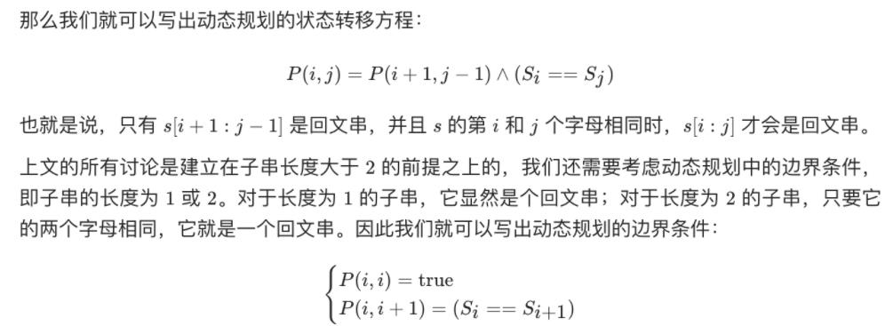

**给你一个字符串 s，找到 s 中最长的回文子串。**

```
输入：s = "babad"
输出："bab"
解释："aba" 同样是符合题意的答案。
```




```
class Solution:
    def longestPalindrome(self, s: str) -> str:
        n = len(s)
        dp = [[False]*n for _ in range(n)]
        ans = ''
        for span in range(n):
            for i in range(n):
                j = span+i
                if j >= len(s):
                    break
                if span == 0:
                    dp[i][j] = True
                elif span == 1:
                    dp[i][j] = (s[i]==s[j])
                else:
                    dp[i][j] = (dp[i+1][j-1] and s[i] == s[j])
                if dp[i][j] and span + 1 > len(ans):
                    ans = s[i:j+1]
        return ans
```