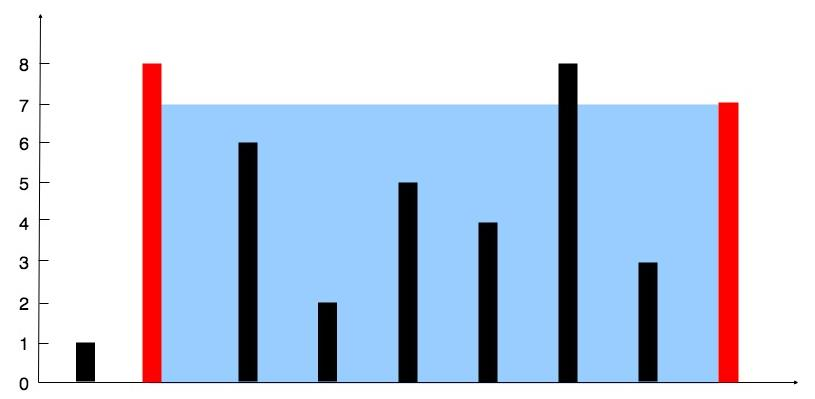

**给定一个长度为 n 的整数数组 height 。有 n 条垂线，第 i 条线的两个端点是 (i, 0) 和 (i, height[i]) 。找出其中的两条线，使得它们与 x 轴共同构成的容器可以容纳最多的水。返回容器可以储存的最大水量。**



```
输入：[1,8,6,2,5,4,8,3,7]
输出：49 
解释：图中垂直线代表输入数组 [1,8,6,2,5,4,8,3,7]。在此情况下，容器能够容纳水（表示为蓝色部分）的最大值为 49。
```

```
class Solution:
    def maxArea(self, height: List[int]) -> int:
        #采用双指针
        left, right = 0, len(height)-1
        res = 0
        #循环终止条件
        while left < right:
            left_height = height[left]
            right_height = height[right]
            #如果左边界高度小于右边界，计算出当前面积，同时左边界右移
            if left_height < right_height:
                cur = left_height*(right-left)
                if cur > res:
                    res = cur
                left += 1
            #如果左边界高度大于等于右边界，计算出当前面积，同时右边界左移    
            else:
                cur = right_height*(right-left)
                if cur > res:
                    res = cur
                right -= 1
        return res
```