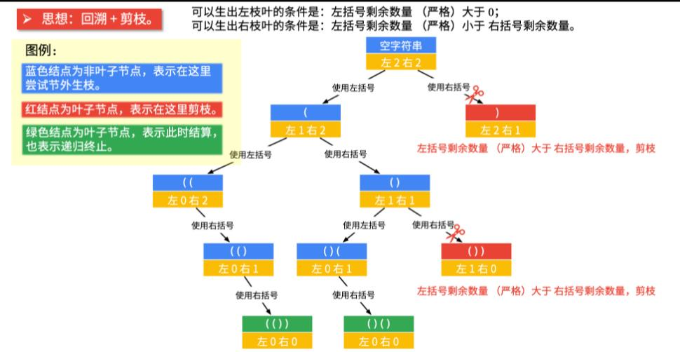

**数字 n 代表生成括号的对数，请你设计一个函数，用于能够生成所有可能的并且有效的括号组合。**

```
输入：n = 3
输出：["((()))","(()())","(())()","()(())","()()()"]
```

Ref: https://leetcode.cn/problems/generate-parentheses/solution/hui-su-suan-fa-by-liweiwei1419/



```
class Solution:
    def generateParenthesis(self, n: int) -> List[str]:
        #回溯法
        res = []
        #当前括号组合
        cur = ''
        #当前剩余左右括号数
        left = right = n
        #构造递归
        def dfs(left, right, cur):
            #递归终止条件
            if left==0 and right==0:
                res.append(cur)
                return
            #情况1
            if left>0:
                dfs(left-1, right, cur+'(')
            #情况1
            if right > left:
                dfs(left, right-1, cur+')')
        #调用递归
        dfs(left, right, cur)
        #返回要优化的目标
        return res
```