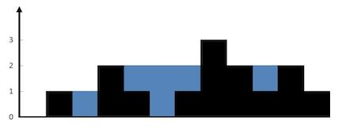
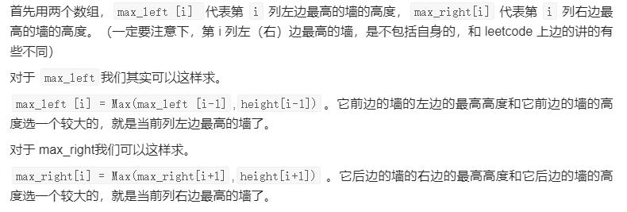

**给定 n 个非负整数表示每个宽度为 1 的柱子的高度图，计算按此排列的柱子，下雨之后能接多少雨水。**



```
输入：height = [0,1,0,2,1,0,1,3,2,1,2,1]
输出：6
解释：上面是由数组 [0,1,0,2,1,0,1,3,2,1,2,1] 表示的高度图，在这种情况下，可以接 6 个单位的雨水（蓝色部分表示雨水）。 
```



```
class Solution:
    def trap(self, height: List[int]) -> int:
        n = len(height)

        max_left = [0]*n
        for i in range(1,n-1):
            max_left[i] = max(max_left[i-1], height[i-1])

        max_right = [0]*n
        for i in range(n-2,0,-1):
            max_right[i] = max(max_right[i+1], height[i+1])

        res = 0
        for i in range(1,n-1):
            h = min(max_left[i], max_right[i])
            if h > height[i]:
                res += (h-height[i])
        return res
```