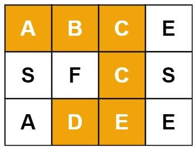

***给定一个 m x n 二维字符网格 board 和一个字符串单词 word 。如果 word 存在于网格中，返回 true ；否则，返回 false 。单词必须按照字母顺序，通过相邻的单元格内的字母构成，其中“相邻”单元格是那些水平相邻或垂直相邻的单元格。同一个单元格内的字母不允许被重复使用。***



```
输入：board = [["A","B","C","E"],["S","F","C","S"],["A","D","E","E"]], word = "ABCCED"
输出：true
```

```
class Solution:
    def exist(self, board: List[List[str]], word: str) -> bool:
        length = len(word)
        m = len(board)
        n = len(board[0])
        #将要遍历的字符串索引
        ind = 0
        #已经走过的网格坐标
        parsed = []
        #构造递归
        def dfs(word_ind, i, j, parsed):
            #递归终止条件
            if word_ind == length:
                return True
            for direct in [(0, 1), (0, -1), (1, 0), (-1, 0)]:
                cur_i = i + direct[0]
                cur_j = j + direct[1]
                if 0<=cur_i<m and 0<=cur_j<n and board[cur_i][cur_j] == word[word_ind] and [cur_i, cur_j] not in parsed:
                    parsed.append([cur_i, cur_j])
                    flag = dfs(word_ind+1, cur_i, cur_j, parsed)
                    if flag:
                        return True
                    else:
                        parsed.remove([cur_i, cur_j])
        #调用递归
        for i in range(m):
            for j in range(n):
                if board[i][j] == word[0]:
                    parsed.append([i,j])
                    flag = dfs(ind+1, i, j, parsed)
                    if flag:
                        return True
                    else:
                        parsed.remove([i,j])
        return False
```