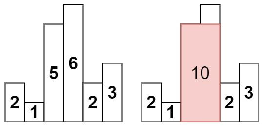

***给定 n 个非负整数，用来表示柱状图中各个柱子的高度。每个柱子彼此相邻，且宽度为 1 。求在该柱状图中，能够勾勒出来的矩形的最大面积。***



```
输入：heights = [2,1,5,6,2,3]
输出：10
解释：最大的矩形为图中红色区域，面积为 10
```

```
class Solution:
    #利用单调栈+哨兵，找到比当前高度小的左右最近索引。首尾加两个0，在结束后，栈一定为空！
    def largestRectangleArea(self, heights: List[int]) -> int:
        heights = [0] + heights + [0]
        stack = []
        res = 0
        for i in range(len(heights)):
            while stack and heights[i] < heights[stack[-1]]:
                tmp = stack.pop()
                res = max(res, (i-stack[-1]-1)*heights[tmp])
            stack.append(i)
        return res
```