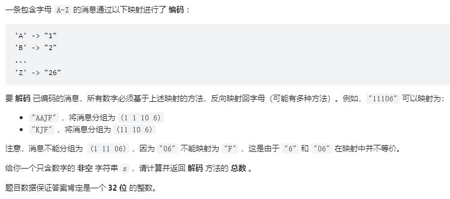
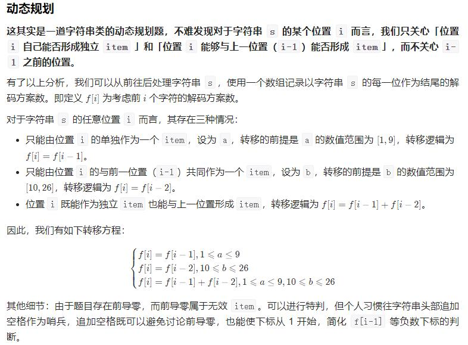

```
class Solution:
    def numDecodings(self, s: str) -> int:
        s = ' '+s
        n = len(s)
        f = [0]*n
        f[0] = 1
        for i in range(1, n):
            a = ord(s[i]) - ord('0')
            b = (ord(s[i-1]) - ord('0'))*10+ord(s[i]) - ord('0')
            if 1<=a<=9:
                f[i] = f[i-1]
            if 10<=b<=26:
                f[i] += f[i-2]
        return f[n-1]
```