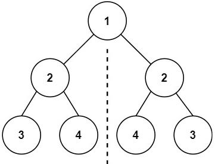

***给你一个二叉树的根节点 root ， 检查它是否轴对称。***



```
class Solution(object):
    def isSymmetric(self, root):
        """
	:type root: TreeNode
	:rtype: bool
	"""
	#如果为空或只有root节点
        if not root or not (root.left or root.right):
	    return True
	# 用队列保存节点	
	queue = [root.left,root.right]
	while queue:
	    # 从队列中取出两个节点，再比较这两个节点
	    left = queue.pop(0)
	    right = queue.pop(0)
	    # 如果两个节点都为空就继续循环，两者有一个为空就返回false
	    if not (left or right):
	        continue
	    if not (left and right):
		return False
	    if left.val!=right.val:
	        return False
	    # 将左节点的左孩子， 右节点的右孩子放入队列
	    queue.append(left.left)
	    queue.append(right.right)
	    # 将左节点的右孩子，右节点的左孩子放入队列
	    queue.append(left.right)
	    queue.append(right.left)
            return True
```
