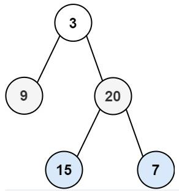

***给你二叉树的根节点 root ，返回其节点值的 层序遍历 。 （即逐层地，从左到右访问所有节点）。***



```
class Solution:
    def levelOrder(self, root: Optional[TreeNode]) -> List[List[int]]:
        #队列+BFS
        queue = [root]
        res = []

        while queue:
            n = len(queue)
            level = []
            #遍历遍历该层所有节点
            for i in range(n):
                node = queue.pop(0)
                if node:
                    queue.append(node.left)
                    queue.append(node.right)
                    level.append(node.val)
            if level:
                res.append(level)
        return res

```