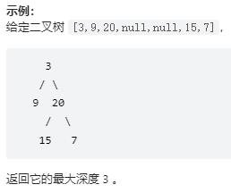

***给定一个二叉树，找出其最大深度。***



```
如何理解递归：
如果一个问题A可以分解为若干个子问题B、C、D，你可以假设子问题B、C、D已经解决。而且，你只需要思考问题A与子问题B、C、D两层之间的关系即可，
不需要一层层往下思考子问题与子子问题，子子问题与子子子问题之间的关系。屏蔽掉递归细节，这样子理解起来就简单多了。 
递归的一个非常重要的点就是：不去管函数的内部细节是如何处理的，我们只看其函数作用以及输入与输出。
```

```
# Definition for a binary tree node.
# class TreeNode:
#     def __init__(self, val=0, left=None, right=None):
#         self.val = val
#         self.left = left
#         self.right = right
class Solution:
    def maxDepth(self, root: Optional[TreeNode]) -> int:
        if not root:
            return 0
        return max(self.maxDepth(root.left), self.maxDepth(root.right))+1
```