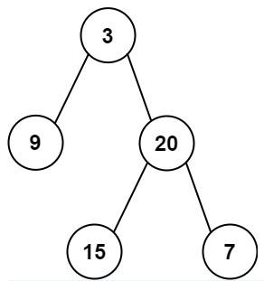
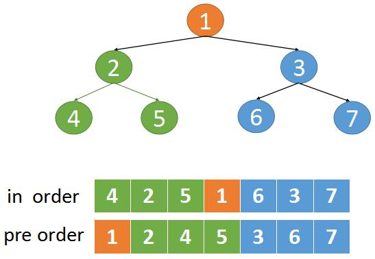

***给定两个整数数组 preorder 和 inorder ，其中 preorder 是二叉树的先序遍历， inorder 是同一棵树的中序遍历，请构造二叉树并返回其根节点。preorder 和 inorder 均无重复元素***



```
输入: preorder = [3,9,20,15,7], inorder = [9,3,15,20,7]
输出: [3,9,20,null,null,15,7]
```
Ref: https://leetcode.cn/problems/construct-binary-tree-from-preorder-and-inorder-traversal/solution/dong-hua-yan-shi-105-cong-qian-xu-yu-zhong-xu-bian/



```
# Definition for a binary tree node.
# class TreeNode(object):
#     def __init__(self, val=0, left=None, right=None):
#         self.val = val
#         self.left = left
#         self.right = right
class Solution(object):
    def buildTree(self, preorder, inorder):
        """
        :type preorder: List[int]
        :type inorder: List[int]
        :rtype: TreeNode
        """
        if not (preorder and inorder):
	        return None
	    #根据前序数组的第一个元素，就可以确定根节点	
        root = TreeNode(preorder[0])
	    #用preorder[0]去中序数组中查找对应的元素
        mid_idx = inorder.index(preorder[0])
	    #递归的处理前序数组的左边部分和中序数组的左边部分
	    #递归处理前序数组右边部分和中序数组右边部分
        root.left = self.buildTree(preorder[1:mid_idx+1],inorder[:mid_idx])
        root.right = self.buildTree(preorder[mid_idx+1:],inorder[mid_idx+1:])
        return root
```