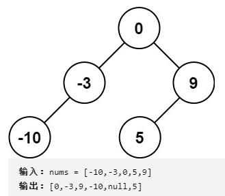

***给你一个整数数组 nums ，其中元素已经按升序排列，请你将其转换为一棵高度平衡二叉搜索树。***



```
# Definition for a binary tree node.
# class TreeNode:
#     def __init__(self, val=0, left=None, right=None):
#         self.val = val
#         self.left = left
#         self.right = right
class Solution:
    def sortedArrayToBST(self, nums: List[int]) -> Optional[TreeNode]:
        if not nums:
            return None
        mid = len(nums)//2
        root = TreeNode(nums[mid])
        root.left = self.sortedArrayToBST(nums[:mid])
        root.right = self.sortedArrayToBST(nums[mid+1:])
        return root
```