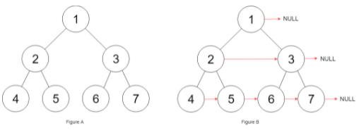

***给定一个 完美二叉树 ，其所有叶子节点都在同一层，每个父节点都有两个子节点。填充它的每个 next 指针，让这个指针指向其下一个右侧节点。如果找不到下一个右侧节点，则将 next 指针设置为 NULL。初始状态下，所有 next 指针都被设置为 NULL。***



```
"""
# Definition for a Node.
class Node:
    def __init__(self, val: int = 0, left: 'Node' = None, right: 'Node' = None, next: 'Node' = None):
        self.val = val
        self.left = left
        self.right = right
        self.next = next
"""

class Solution:
    def connect(self, root: 'Optional[Node]') -> 'Optional[Node]':
        #层序遍历
        if not root:
            return root
        queue = [root]
        while queue:
            n = len(queue)
            tmp = queue[0]
            for i in range(1, n):
                tmp.next = queue[i]
                tmp = queue[i]
            for i in range(n):
                node = queue.pop(0)
                if node.left:
                    queue.append(node.left)
                if node.right:
                    queue.append(node.right)
        return root
```