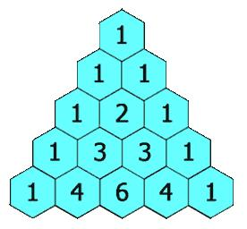

***给定一个非负整数 numRows，生成「杨辉三角」的前 numRows 行。***



```
class Solution:
    def generate(self, numRows: int) -> List[List[int]]:
        #观察一下规律，发现当前一行只比上一行多了一个元素，最最关键的一点：本行元素等于上一行元素往后错一位再逐个相加
        res = [[1]]
        while len(res) < numRows:
            newRow = [ a+b for a,b in zip(res[-1]+[0], [0]+res[-1])]
            res.append(newRow)
        return res
```