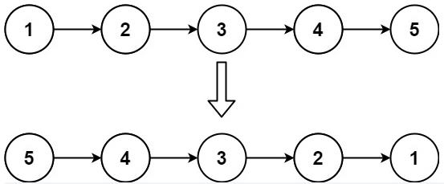

***给你单链表的头节点 head ，请你反转链表，并返回反转后的链表。***



```
输入：head = [1,2,3,4,5]
输出：[5,4,3,2,1]
```

```
# Definition for singly-linked list.
# class ListNode:
#     def __init__(self, val=0, next=None):
#         self.val = val
#         self.next = next
class Solution:
    def reverseList(self, head: Optional[ListNode]) -> Optional[ListNode]:
        # 申请两个节点，pre和 cur，pre指向None
        pre = None
        cur = head
        while cur:
            # 记录当前节点的下一个节点
            tmp = cur.next
            # 然后将当前节点指向pre
            cur.next = pre
            # pre和cur节点都前进一位
            pre = cur
            cur = tmp
        return pre
```

```
# Definition for singly-linked list.
# class ListNode:
#     def __init__(self, val=0, next=None):
#         self.val = val
#         self.next = next
class Solution:
    def reverseList(self, head: Optional[ListNode]) -> Optional[ListNode]:
        #递归终止条件
        if not head or not head.next:
            return head
        cur = self.reverseList(head.next)
        head.next.next = head
        head.next = None
        return cur
```
