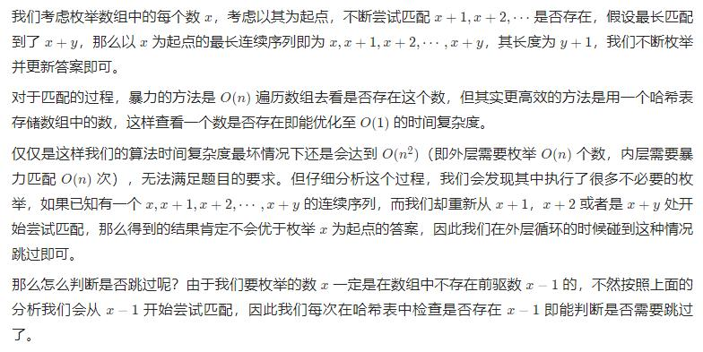

***给定一个未排序的整数数组 nums ，找出数字连续的最长序列（不要求序列元素在原数组中连续）的长度。请你设计并实现时间复杂度为 O(n) 的算法解决此问题。***

Ref: https://leetcode.cn/problems/longest-consecutive-sequence/solution/zui-chang-lian-xu-xu-lie-by-leetcode-solution/


```
class Solution:
    def longestConsecutive(self, nums: List[int]) -> int:
        longest_streak = 0
        num_set = set(nums)
        for num in num_set:
            if num - 1 not in num_set:
                current_num = num
                current_streak = 1
                while current_num + 1 in num_set:
                    current_num += 1
                    current_streak += 1
                longest_streak = max(longest_streak, current_streak)
        return longest_streak
```