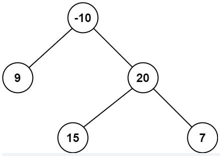

***路径 被定义为一条从树中任意节点出发，沿父节点-子节点连接，达到任意节点的序列。同一个节点在一条路径序列中至多出现一次 。该路径至少包含一个 节点，且不一定经过根节点。***

Ref: https://leetcode.cn/problems/binary-tree-maximum-path-sum/solution/er-cha-shu-zhong-de-zui-da-lu-jing-he-by-leetcode-/


```
输入：root = [-10,9,20,null,null,15,7]
输出：42
解释：最优路径是 15 -> 20 -> 7 ，路径和为 15 + 20 + 7 = 42
```

```
# Definition for a binary tree node.
# class TreeNode(object):
#     def __init__(self, val=0, left=None, right=None):
#         self.val = val
#         self.left = left
#         self.right = right
class Solution(object):

    #首先，考虑实现一个简化的函数 maxGain(node)，该函数计算二叉树中的一个节点的最大贡献值，具体而言，就是在以该节点为根节点的子树中寻找以该节点为起点的一条路径，使得该路径上的节点值之和最大。
    #根据函数 maxGain 得到每个节点的最大贡献值之后，对于二叉树中的一个节点，该节点的最大路径和取决于该节点的值与该节点的左右子节点的最大贡献值，如果子节点的最大贡献值为正，则计入该节点的最大路径和，否则不计入该节点的最大路径和。

    def maxPathSum(self, root: TreeNode) -> int:
        self.maxSum = float("-inf")
        def maxGain(node):
            if not node:
                return 0

            # 递归计算左右子节点的最大贡献值
            # 只有在最大贡献值大于 0 时，才会选取对应子节点
            leftGain = max(maxGain(node.left), 0)
            rightGain = max(maxGain(node.right), 0)
            
            # 节点的最大路径和取决于该节点的值与该节点的左右子节点的最大贡献值
            priceNewpath = node.val + leftGain + rightGain
            
            # 更新答案
            self.maxSum = max(self.maxSum, priceNewpath)
        
            # 返回节点的最大贡献值
            return node.val + max(leftGain, rightGain)
   
        maxGain(root)
        return self.maxSum
```