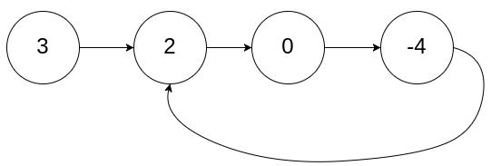

***给你一个链表的头节点 head ，判断链表中是否有环。***



```
# Definition for singly-linked list.
# class ListNode:
#     def __init__(self, x):
#         self.val = x
#         self.next = None

class Solution:
    def hasCycle(self, head: Optional[ListNode]) -> bool:
        #我们定义两个指针，一快一满。慢指针每次只移动一步，而快指针每次移动两步。
        #初始时，慢指针在位置 head，而快指针在位置 head.next。这样一来，如果在移动的过程中，快指针反过来追上慢指针，就说明该链表为环形链表。否则快指针将到达链表尾部，该链表不为环形链表。
        if not head or not head.next:
            return False
        slow = head
        fast = head.next
        while slow != fast:
            if not fast or not fast.next:
                return False
            slow = slow.next
            fast = fast.next.next
        return True
```

```
class Solution(object):
    def hasCycle(self, head):
        """
        :type head: ListNode
        :rtype: bool
        """

        slow = fast = head
        while fast and fast.next:
            slow = slow.next
            fast = fast.next.next
            if slow == fast:
                return True
        return False
```