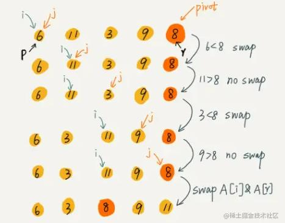

***给定整数数组 nums 和整数 k，请返回数组中第 k 个最大的元素。***



```
class Solution:
    def findKthLargest(self, nums: List[int], k: int) -> int:

        def partition(nums, left, right):
            pivot = nums[right]
            i = left
            for j in range(left, right+1):
                if nums[j] < pivot:
                    nums[i], nums[j] = nums[j], nums[i]
                    i += 1
            nums[i], nums[j] = nums[j], nums[i]
            return i

        n = len(nums)
        left = 0
        right = n-1
        target = n-k
        while True:
            index = partition(nums, left, right)
            if index == target:
                return nums[index]
            elif index < target:
                left = index+1
            else:
                right = index-1

```