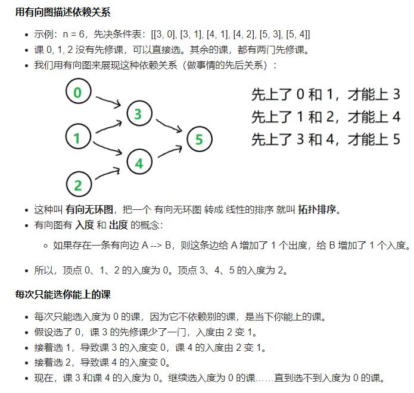

***你这个学期必须选修 numCourses 门课程，记为 0 到 numCourses - 1 。在选修某些课程之前需要一些先修课程。 先修课程按数组 prerequisites 给出，其中 prerequisites[i] = [ai, bi] ，表示如果要学习课程 ai 则 必须 先学习课程  bi 。***

```
输入：numCourses = 2, prerequisites = [[1,0],[0,1]]
输出：false
解释：总共有 2 门课程。学习课程 1 之前，你需要先完成​课程 0 ；并且学习课程 0 之前，你还应先完成课程 1 。这是不可能的。
```

Ref: https://leetcode.cn/problems/course-schedule/solution/bao-mu-shi-ti-jie-shou-ba-shou-da-tong-tuo-bu-pai-/



```
class Solution:
    def canFinish(self, numCourses: int, prerequisites: List[List[int]]) -> bool:

        edges = collections.defaultdict(list)
        indeg = [0]*numCourses

        for info in prerequisites:
            edges[info[1]].append(info[0])
            indeg[info[0]] += 1
        #初始化入度为0的课程放入队列
        queue = [ind for ind, c in enumerate(indeg) if c==0 ]
        visited = 0
        while queue:
            visited += 1
            c = queue.pop(0)
            for v in edges[c]:
                indeg[v] -= 1
                if indeg[v] == 0:
                    queue.append(v)
        return visited == numCourses
```
