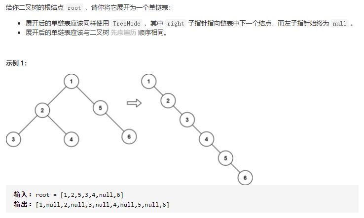
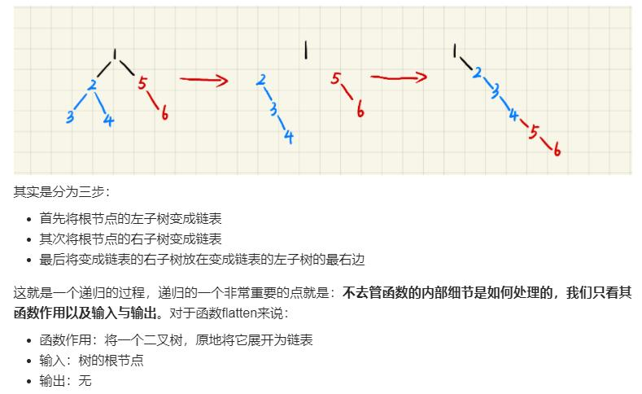

```
# Definition for a binary tree node.
# class TreeNode(object):
#     def __init__(self, val=0, left=None, right=None):
#         self.val = val
#         self.left = left
#         self.right = right
class Solution(object):
    def flatten(self, root):
        """
        :type root: TreeNode
        :rtype: None Do not return anything, modify root in-place instead.
        """

        if not root:
            return
        self.flatten(root.left)
        self.flatten(root.right)
        tmp = root.right
        root.right = root.left
        root.left = None
        while root.right:
            root = root.right
        root.right = tmp
```