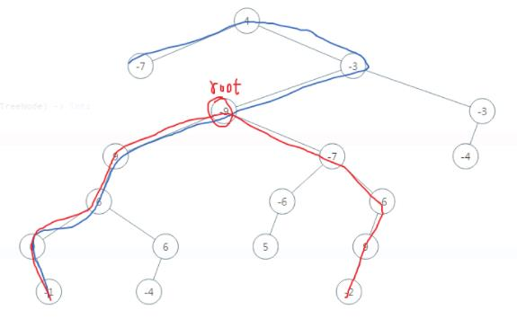

***给定一棵二叉树，你需要计算它的直径长度。一棵二叉树的直径长度是任意两个结点路径长度中的最大值。这条路径可能穿过也可能不穿过根结点。如图所示，二叉树的直径为8***



```
# Definition for a binary tree node.
# class TreeNode(object):
#     def __init__(self, val=0, left=None, right=None):
#         self.val = val
#         self.left = left
#         self.right = right
class Solution:
    def diameterOfBinaryTree(self, root):
        self.ans = 0
        def depth(node):
            # 访问到空节点了，返回0
            if not node:
                return 0
            # 左儿子为根的子树的深度
            L = depth(node.left)
            # 右儿子为根的子树的深度
            R = depth(node.right)
            # 计算d_node即L+R 并更新ans
            self.ans = max(self.ans, L + R)
            # 返回该节点为根的子树的深度
            return max(L, R) + 1

        depth(root)
        return self.ans
```