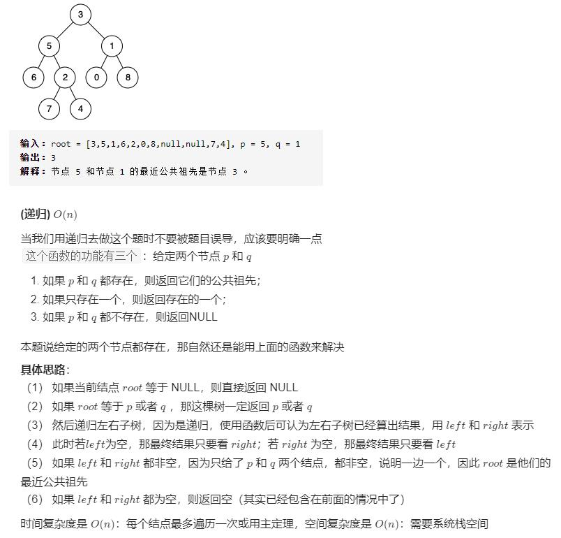

```
# Definition for a binary tree node.
# class TreeNode(object):
#     def __init__(self, x):
#         self.val = x
#         self.left = None
#         self.right = None

class Solution(object):
    def lowestCommonAncestor(self, root, p, q):
        """
        :type root: TreeNode
        :type p: TreeNode
        :type q: TreeNode
        :rtype: TreeNode
        """

        if not root:
            return None
        if (p==root) or (q==root):
            return root

        left = self.lowestCommonAncestor(root.left, p, q)
        right = self.lowestCommonAncestor(root.right, p, q)
        if not left:
            return right
        if not right:
            return left
        if left and right:
            return root
```

二叉搜索树的最近公共祖先:
```
# Definition for a binary tree node.
# class TreeNode:
#     def __init__(self, x):
#         self.val = x
#         self.left = None
#         self.right = None

class Solution:
    def lowestCommonAncestor(self, root: 'TreeNode', p: 'TreeNode', q: 'TreeNode') -> 'TreeNode':
        if p.val < root.val and q.val < root.val:
            return self.lowestCommonAncestor(root.left, p, q)
        elif p.val > root.val and q.val > root.val:
            return self.lowestCommonAncestor(root.right, p, q)
        return root
```