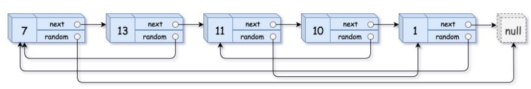

***请实现 copyRandomList 函数，复制一个复杂链表。在复杂链表中，每个节点除了有一个 next 指针指向下一个节点，还有一个 random 指针指向链表中的任意节点或者 null。***



```
class Solution:
    def copyRandomList(self, head: 'Node') -> 'Node':
        if not head: return
        cur = head
        # 1. 复制各节点，并构建拼接链表
        while cur:
            tmp = Node(cur.val)
            tmp.next = cur.next
            cur.next = tmp
            cur = tmp.next
        # 2. 构建各新节点的 random 指向
        cur = head
        while cur:
            if cur.random:
                cur.next.random = cur.random.next
            cur = cur.next.next
        # 3. 拆分两链表
        cur = dummy = head.next
        pre = head
        while cur.next:
            pre.next = pre.next.next
            cur.next = cur.next.next
            pre = pre.next
            cur = cur.next
        pre.next = None # 单独处理原链表尾节点
        return dummy      # 返回新链表头节点
```