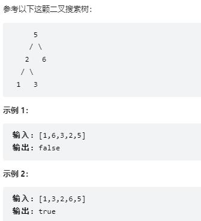

***输入一个整数数组，判断该数组是不是某二叉搜索树的后序遍历结果。如果是则返回 true，否则返回 false。假设输入的数组的任意两个数字都互不相同。***



```
class Solution:
    def verifyPostorder(self, postorder: List[int]) -> bool:
        n = len(postorder)
        if n<=1:
            return True
        root = postorder[-1]
        for i in range(n):
            if postorder[i] > root:
                break
        #找到左右子树对应区间
        left,right = postorder[:i],postorder[i:-1]
        for k in right:
            if k < root: 
                return False
        return self.verifyPostorder(left) and self.verifyPostorder(right)
```