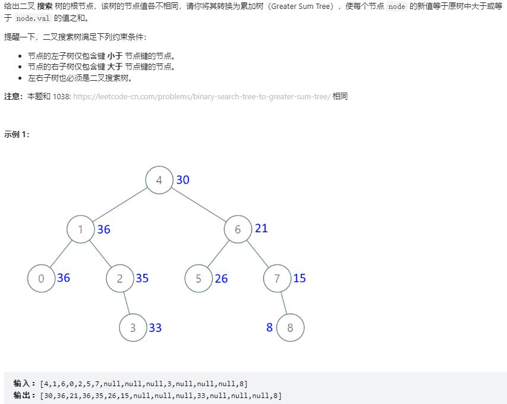

```
# Definition for a binary tree node.
# class TreeNode:
#     def __init__(self, val=0, left=None, right=None):
#         self.val = val
#         self.left = left
#         self.right = right
class Solution:
    def convertBST(self, root: Optional[TreeNode]) -> Optional[TreeNode]:
        self.total = 0
        def dfs(node):
            #1.更新total 2.变成累加
            if not node:
                return
            dfs(node.right)
            self.total += node.val
            node.val = self.total
            dfs(node.left)

        recur(root)
        return root
```
