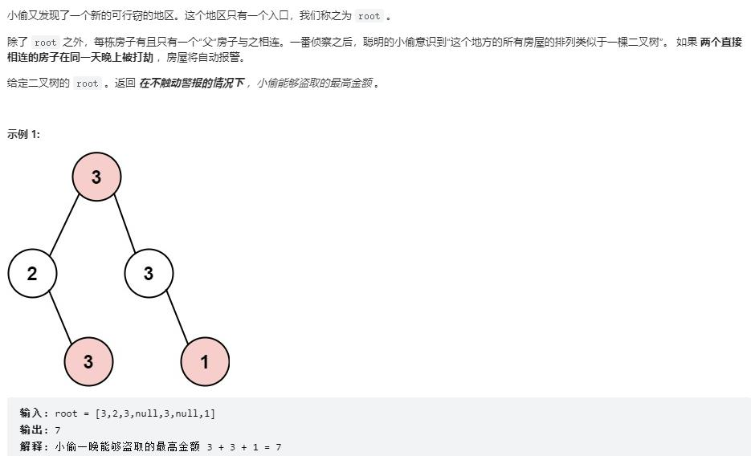

```
# Definition for a binary tree node.
# class TreeNode:
#     def __init__(self, val=0, left=None, right=None):
#         self.val = val
#         self.left = left
#         self.right = right
class Solution:
    def rob(self, root: Optional[TreeNode]) -> int:
        def dfs(node):
            #返回该节点不偷和偷状态下能够偷取的最大值
            if node is None:
                return [0,0]
            
            left = dfs(node.left)
            right = dfs(node.right)

            dp = [0, 0]
            #dp[0]表示以当前节点不偷状态下子树能够偷取的最大值,注意当前节点不偷的话，它的子树可以偷也可以不偷
            dp[0] = max(left) + max(right)
            #dp[1]表示当前节点偷状态下子树能够偷取的最大值
            dp[1] = node.val + left[0] + right[0]
            return dp

        res = dfs(root)
        return max(res)
```
