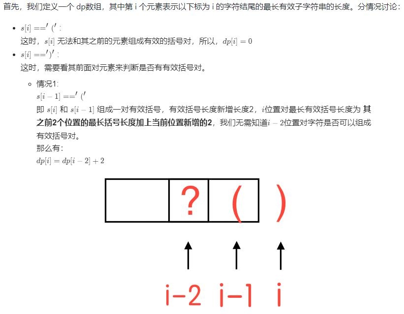
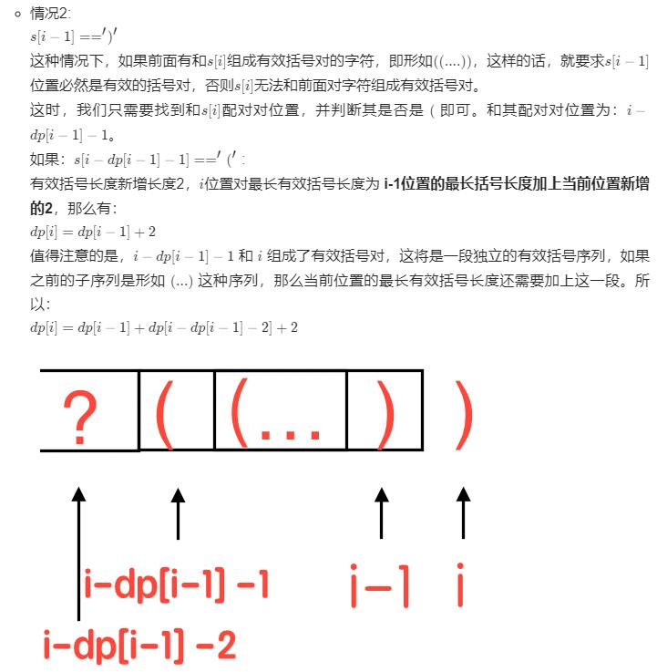

***给你一个只包含 '(' 和 ')' 的字符串，找出最长有效（格式正确且连续）括号子串的长度。***




```
class Solution:
    def longestValidParentheses(self, s: str) -> int:
        if not s:
            return 0
        n = len(s)
        dp = [0]*n

        for i in range(1,n):
            if s[i] == ')':
                if s[i-1] == '(':
                    dp[i] = dp[i-2]+2 if (i-2) >= 0 else 2
                else:
                    if (i-dp[i-1]-1) >= 0 and s[i-dp[i-1]-1] == '(':
                        dp[i] = dp[i-1]+2
                        if (i-dp[i-1]-2) >= 0:
                            dp[i] += dp[i-dp[i-1]-2]
        return max(dp)
```