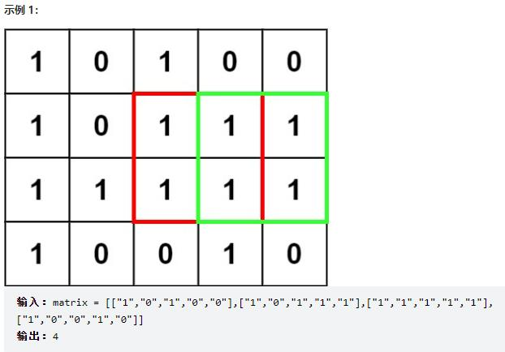

***在一个由 '0' 和 '1' 组成的二维矩阵内，找到只包含 '1' 的最大正方形，并返回其面积。***



```
class Solution:
    def maximalSquare(self, matrix: List[List[str]]) -> int:
        #dp(i, j) 是以 matrix(i - 1, j - 1) 为 右下角 的正方形的最大边长。
        m = len(matrix)
        n = len(matrix[0])

        dp = [[0]*(n+1) for _ in range(m+1)]
        res = 0
        for i in range(1, m+1):
            for j in range(1, n+1):
                if matrix[i-1][j-1] == '1':
                    dp[i][j] = min(dp[i-1][j], dp[i][j-1], dp[i-1][j-1])+1
                    res = max(res, dp[i][j]*dp[i][j])
        return res
```