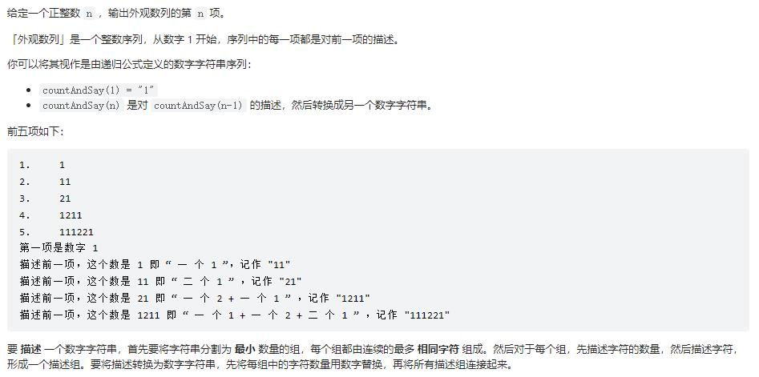

```
class Solution:
    def countAndSay(self, n: int) -> str:
        pre = '1'
        for i in range(n-1):
            stack = []
            count = ''
            cur = ''
            for ind, digit in enumerate(pre):
                if stack and digit == stack[-1][1]:
                    continue
                if stack and digit != stack[-1][1]:
                    last_ind, last_digit = stack.pop()
                    count = str(ind-last_ind)
                    cur += (count+str(last_digit))
                stack.append([ind, digit])

            last_ind, last_digit = stack.pop()
            count = str(ind-last_ind+1)
            cur += (count+str(last_digit)) 

            pre = cur
        return pre
```