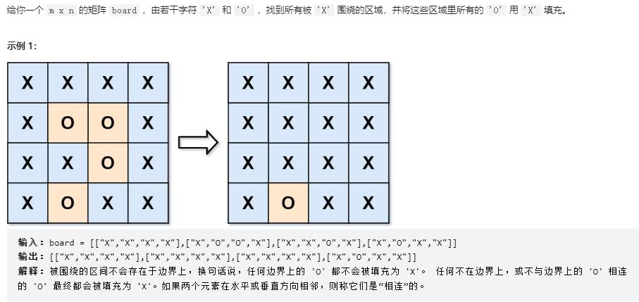

```
class Solution:
    def solve(self, board: List[List[str]]) -> None:
        """
        Do not return anything, modify board in-place instead.
        """
        m = len(board)
        n = len(board[0])

        def dfs(i,j):
            if not 0<=i<m or not 0<=j<n or board[i][j] != 'O':
                return
            board[i][j] = 'A'
            #情况1
            dfs(i+1,j)
            #情况2
            dfs(i-1,j)
            #情况3
            dfs(i,j+1)
            #情况4
            dfs(i,j-1)             

        for i in range(m):
            dfs(i,0)
            dfs(i,n-1)

        for j in range(n):
            dfs(0, j)
            dfs(m-1, j)

        for i in range(m):
            for j in range(n):
                if board[i][j] == 'A':
                    board[i][j] = 'O'
                elif board[i][j] == 'O':
                    board[i][j] = 'X'
```