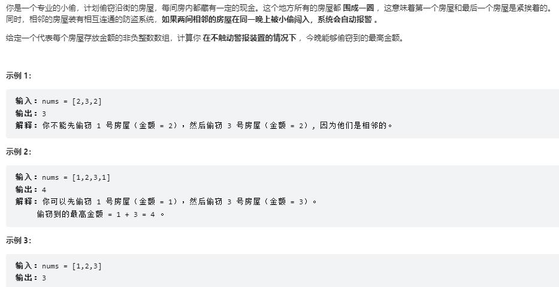

```
class Solution:
    def rob(self, nums: List[int]) -> int:
        n = len(nums)
        if n<=3:
            return max(nums)
        #偷第一号房
        max_1 = [0]*n
        max_1[0] = max_1[1] = nums[0]
        for i in range(2, n-1):
            max_1[i] = max(nums[i]+max_1[i-2], max_1[i-1])
        #不偷第一号房
        max_0 = [0]*n
        max_0[1] = nums[1]
        for i in range(2, n):
                max_0[i] = max(nums[i]+max_0[i-2], max_0[i-1])
        return max(max(max_1), max(max_0))
```