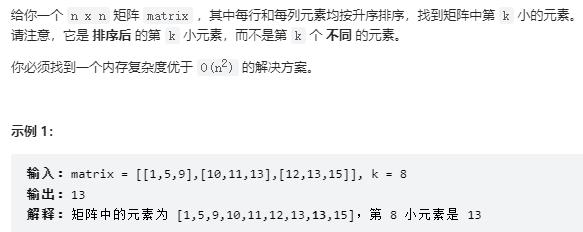

- ref: https://leetcode.cn/problems/kth-smallest-element-in-a-sorted-matrix/solution/shi-yong-dui-heapde-si-lu-xiang-jie-ling-fu-python/

```
class Solution:
    def kthSmallest(self, matrix: List[List[int]], k: int) -> int:
        n = len(matrix) #注：题目中这个矩阵是n*n的，所以长宽都是n

        pq = [(matrix[i][0], i, 0) for i in range(n)] #取出第一列候选人
        #matrix[i][0]是具体的值，后面的(i,0)是在记录候选人在矩阵中的位置，方便每次右移添加下一个候选人

        heapq.heapify(pq) #变成一个heap

        for i in range(k - 1): #一共弹k次：这里k-1次，return的时候1次
            num, x, y = heapq.heappop(pq) #弹出候选人里最小一个
            if y != n - 1: #如果这一行还没被弹完
                heapq.heappush(pq, (matrix[x][y + 1], x, y + 1)) #加入这一行的下一个候选人
        
        return heapq.heappop(pq)[0]
```