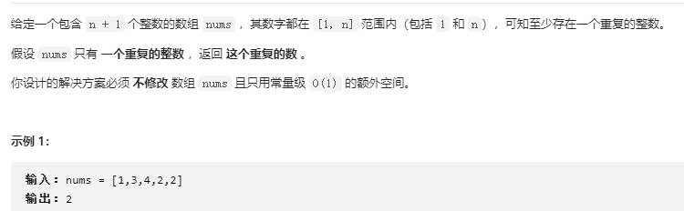

```
class Solution:
    def findDuplicate(self, nums: List[int]) -> int:
        #在 [1..n] 查找 nums 中重复的元素
        left = 1
        right = len(nums)-1
        while left < right:
            mid = (left+right) //2
            #nums 中小于等于 mid 的元素的个数
            cnt = 0
            for num in nums:
                if num <= mid:
                    cnt += 1
            #下一轮搜索的区间 [left..mid]        
            if cnt > mid:
                right = mid
            #下一轮搜索的区间 [mid + 1..right]
            else:
                left = mid+1
        return left
```