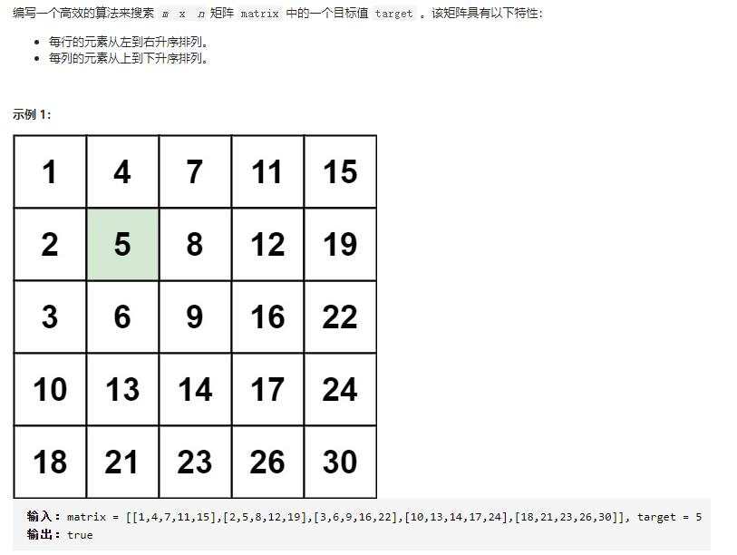

```
class Solution(object):
    def searchMatrix(self, matrix, target):
        """
        :type matrix: List[List[int]]
        :type target: int
        :rtype: bool
        """

        row = len(matrix)-1
        col = 0
        start = matrix[row][col]

        while (row>=0 and col < len(matrix[0])):
            if matrix[row][col] < target:
                col += 1
            elif matrix[row][col] > target:
                row -= 1
            else:
                return True
        return False
```