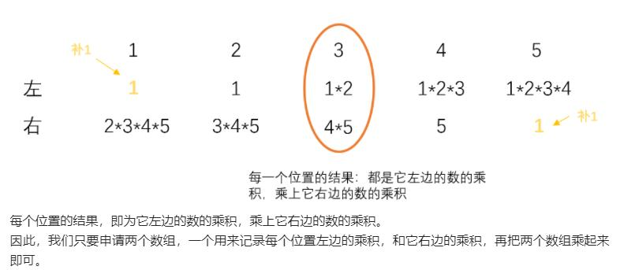

***给你一个长度为 n 的整数数组 nums，其中 n > 1，返回输出数组 output ，其中 output[i] 等于 nums 中除 nums[i] 之外其余各元素的乘积。***



```
class Solution(object):
    def productExceptSelf(self, nums):
        """
        :type nums: List[int]
        :rtype: List[int]
        """
        #前缀积/后缀积
        n = len(nums)
        left = [1]*n
        for i in range(1, n):
            left[i] = left[i-1]*nums[i-1]

        res = 1
        for i in range(n-1, -1, -1):
            left[i] *= res
            res *= nums[i]
        return left
```